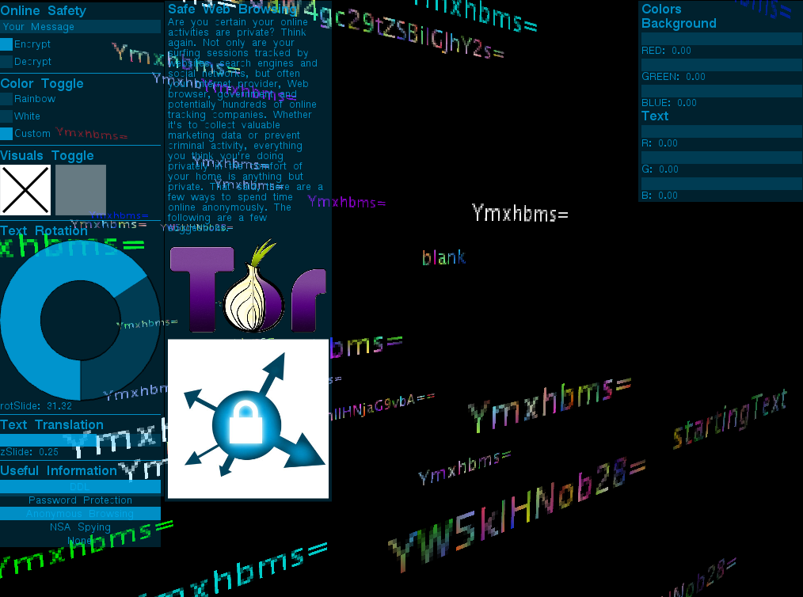
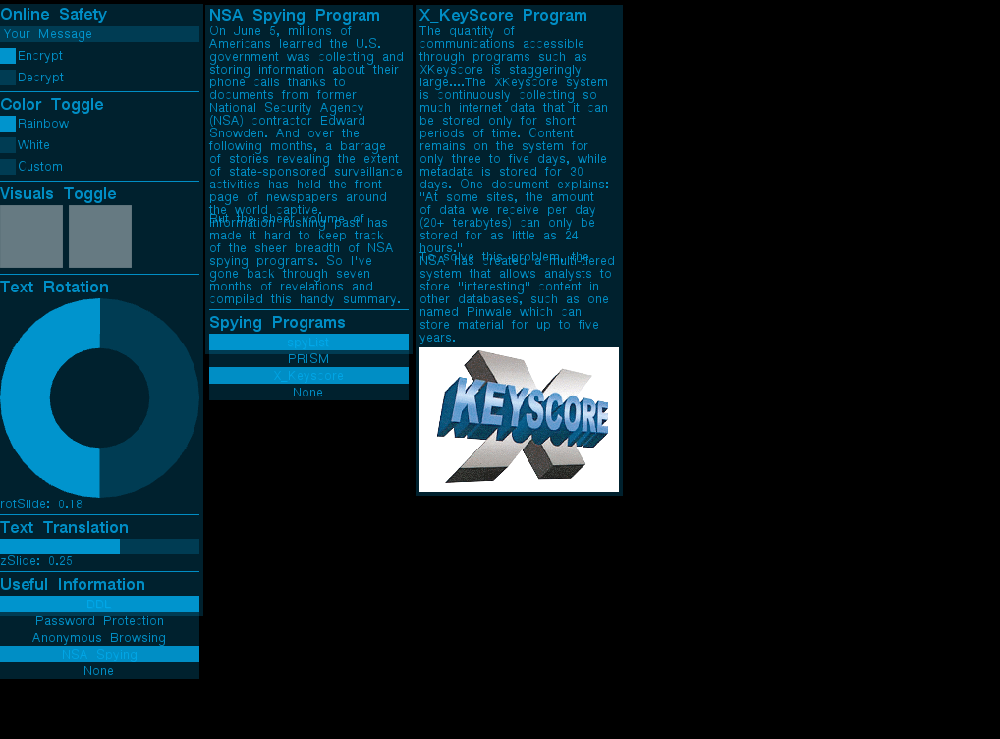

#Advanced Coding Final Project
##Description
This project is designed to function as both a visually and textually informative tool about online safety.  Every day millions of people use the internet oblivious to the vast amount of sensitive personal information they are inadvertently exposing to the world.  My project was designed to address this problem by first providing a visual representation of how vulnerable people's data is when left unprotected.  In order to do this I was going to use plain text input, a base64 encoder and decoder algorithm, and an AES encryption algorithm.  The idea was to show how your information appears to potential thiefs when you store it on different online mediums.  Plain text would represent a wall post on Facebook or a tweet on Twitter, information that is put in plain sight for everyone to see.  Base64 encoded text would represent low-security e-mail exchanges or private messages through unsecure social media platforms, encrypted text but easily decrypted with the proper algorithm.  Finally AES encryption would represent the most secure form of data storage/exchange.  The user would have to write out their message and memorize their encryption key but in seeing the resulting AES encryption and correlating visuals the user would realize that there is a way to make their information pretty much invulnerable.

- - -
The second part of my project acts as more of an informative guide about online safety.  It provides an overview of ways in which your online data is vulnerable: weak passwords, unencrypted message exchanges, unprotected URLs, etc, and it provides information about the NSA and its various data collection programs.  The guide also has information of ways you can protect yourself: using a password manager to protect your personal online profiles from bruteforce attacks, browsing anonymously with tor, using only https encrypted websites, etc.  Unfortuantely I again was limited by time and I wasn't able to do my own write-ups about this information. As of now the information provided comes directly out of articles from wikipedia and The Guardian but I will be sure and change this as soon as possible.
##Add-Ons
ofxGui (used)
ofxOpenCV (unused)
ofxXmlSettings (used)
ofxAssets (used)
ofxCv (unused)
ofxGif (unused)
ofxUI (used)
##Screen Shots

